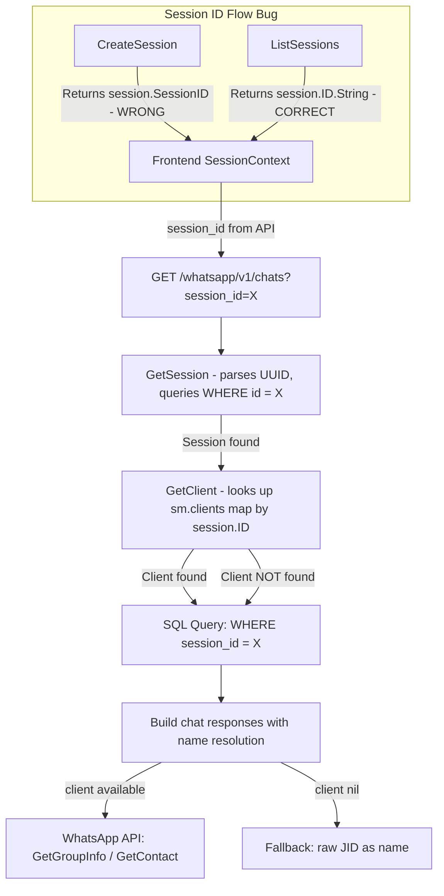

# Fix: Session Isolation — Chats Not Loading for Second Session

## Problem Statement

When a user has multiple WhatsApp sessions (e.g., Session 1 and Session 2), chats only load for the first session. Switching to the second session shows no chats. The root cause is a combination of **session ID mismatches**, **device matching ambiguity**, and **client resolution bugs** across the backend.

---

## Root Cause Analysis

### 🔴 ROOT CAUSE 1: `session_id` Field Confusion (Critical)

The [`WhatsAppSessionModel`](server/model/whatsapp_session.model.go:11) has **two ID fields**:
- `ID` — `uuid.UUID` primary key (auto-generated)
- `SessionID` — `string` field (deprecated, set to a UUIDv7 string)

The codebase is inconsistent about which one is used:

| Location | Uses | Should Use |
|----------|------|------------|
| [`session_handler.go:83`](server/module/whatsapp/session/session_handler.go:83) CreateSession response | `session.SessionID` (string field) | `session.ID.String()` (UUID PK) |
| [`session_handler.go:129`](server/module/whatsapp/session/session_handler.go:129) ListSessions response | `session.ID.String()` ✅ | Correct |
| [`session_handler.go:193`](server/module/whatsapp/session/session_handler.go:193) GetSessionDetail response | `session.SessionID` (string field) | `session.ID.String()` (UUID PK) |
| [`session_manager.go:470`](server/connection/session_manager.go:470) handleEvent message save | `session.ID.String()` ✅ | Correct |
| [`chat_handler.go:160`](server/module/whatsapp/chat/chat_handler.go:160) GetChats SQL query | `activeSession.ID.String()` ✅ | Correct |

**Impact:** When the frontend creates a session, it receives `session.SessionID` (the deprecated string). When it later calls `GetChats?session_id=<that_value>`, the backend's [`GetSession()`](server/connection/session_manager.go:123) parses it as UUID and queries `WHERE id = ?`. Since `SessionID` string ≠ `ID` UUID, the session lookup **fails silently** or returns the wrong session.

The `ListSessions` endpoint correctly returns `session.ID.String()`, so after a page refresh the frontend gets the correct ID. But the **first session created** in a browser session will have the wrong ID cached in localStorage.

### 🔴 ROOT CAUSE 2: Device Matching Picks First Match (Critical)

In [`ConnectSession()`](server/connection/session_manager.go:154) and [`RestoreExistingSessions()`](server/connection/session_manager.go:811), device matching is done by phone number:

```go
if device.ID != nil && device.ID.User == *session.PhoneNumber {
    deviceStore = device
    break
}
```

**Problem:** If two sessions have the same phone number (unlikely but possible during re-pairing), or if `PhoneNumber` is nil for a new session, the matching is ambiguous. More critically, `GetAllDevices()` returns **all** whatsmeow devices across all sessions. There is no mapping between a whatsmeow device and a Loko session — the only link is the phone number, which is only set **after** successful pairing.

For a **second session that hasn't been paired yet**, `PhoneNumber` is nil, so the code falls through to `sm.container.NewDevice()` — this is correct. But after pairing, if the user disconnects and reconnects, the device matching loop may pick the **wrong device** if multiple devices exist.

### 🟡 ROOT CAUSE 3: Receipt Handler Uses Wrong Type for session_id Query

In [`handleEvent()`](server/connection/session_manager.go:696) for `*events.Receipt`:

```go
Where("session_id = ? AND message_id IN ?", sessionID, evt.MessageIDs)
```

Here `sessionID` is `uuid.UUID` but `whatsapp_messages.session_id` is stored as a **string** (from `session.ID.String()`). GORM may handle this conversion, but it's fragile and could cause receipt updates to silently fail for some sessions.

### 🟡 ROOT CAUSE 4: Redis Key Mismatch

Messages are stored under `chats:data:<sessionID>:<chatJID>` but read receipts clear `chat:<sessionID>:<chatJID>` — different key prefix. Unread counts never reset via receipts.

### 🟡 ROOT CAUSE 5: GetChats Client Resolution

In [`chat_handler.go:133`](server/module/whatsapp/chat/chat_handler.go:133):

```go
client, exists := sessionManager.GetClient(activeSession.ID)
```

If the second session's client isn't in the `sm.clients` map (e.g., it was restored but failed to connect), `client` is nil. The code continues but all name resolution falls back to raw JID numbers. This makes it **appear** like chats aren't loading when they actually are — just without names.

---

## Architecture Diagram



---

## Fix Plan

### Fix 1: Unify session_id in API responses

**File:** [`server/module/whatsapp/session/session_handler.go`](server/module/whatsapp/session/session_handler.go)

- **Line 83:** Change `SessionID: session.SessionID` → `SessionID: session.ID.String()`
- **Line 193:** Change `SessionID: session.SessionID` → `SessionID: session.ID.String()`

This ensures the frontend always receives the UUID primary key, not the deprecated string field.

### Fix 2: Fix receipt handler session_id type

**File:** [`server/connection/session_manager.go`](server/connection/session_manager.go)

- **Line 696:** Change `sessionID` to `sessionID.String()` in the WHERE clause:
  ```go
  Where("session_id = ? AND message_id IN ?", sessionID.String(), evt.MessageIDs)
  ```

### Fix 3: Fix Redis key mismatch in receipt handler

**File:** [`server/connection/session_manager.go`](server/connection/session_manager.go)

- **Line 723:** Change `chat:%s:%s` to `chats:data:%s:%s`:
  ```go
  chatKey := fmt.Sprintf("chats:data:%s:%s", sessionID.String(), evt.Chat.String())
  ```

### Fix 4: Add error checking for GetChats SQL query

**File:** [`server/module/whatsapp/chat/chat_handler.go`](server/module/whatsapp/chat/chat_handler.go)

- **Line 147-160:** Capture and check the error from `h.DB.Raw(...).Scan(...)`:
  ```go
  if err := h.DB.Raw(...).Scan(&recentChats).Error; err != nil {
      log.Printf("GetChats: SQL query failed: %v", err)
      return c.Status(fiber.StatusInternalServerError).JSON(...)
  }
  ```

### Fix 5: Improve device matching robustness in ConnectSession

**File:** [`server/connection/session_manager.go`](server/connection/session_manager.go)

- **Lines 154-166:** The current device matching by phone number is the only viable approach with whatsmeow's architecture. However, add logging to make debugging easier:
  ```go
  log.Printf("Session %s: Searching for device with phone %s among %d devices", 
      session.ID, *session.PhoneNumber, len(devices))
  ```

### Fix 6: Ensure GetChats gracefully handles missing client

**File:** [`server/module/whatsapp/chat/chat_handler.go`](server/module/whatsapp/chat/chat_handler.go)

- The current code already handles `client == nil` with fallbacks. No change needed, but add a log line indicating the session ID for debugging:
  ```go
  log.Printf("⚠️ [CHAT LIST] Client not available for session %s name resolution", activeSession.ID)
  ```

### Fix 7: Add defensive user_id check in GetChats

**File:** [`server/module/whatsapp/chat/chat_handler.go`](server/module/whatsapp/chat/chat_handler.go)

- **Line 85:** Add nil check before type assertion:
  ```go
  userIDVal := c.Locals("user_id")
  if userIDVal == nil {
      return c.Status(fiber.StatusUnauthorized).JSON(...)
  }
  userID := userIDVal.(string)
  ```

---

## Priority Order

1. **Fix 1** — This is the most likely root cause of the reported issue. The session_id mismatch means the second session created in a browser session will have the wrong ID.
2. **Fix 2** — Receipt updates silently failing for some sessions.
3. **Fix 3** — Redis unread counts never resetting.
4. **Fix 4** — Silent SQL failures hiding real errors.
5. **Fix 5** — Better debugging for device matching.
6. **Fix 6** — Better logging for client resolution.
7. **Fix 7** — Prevent potential panic.

---

## Testing Strategy

1. Create two sessions via the API
2. Verify both return `session.ID.String()` as `session_id`
3. Connect both sessions (scan QR)
4. Send messages to both sessions
5. Call `GET /whatsapp/v1/chats?session_id=<session1_uuid>` — verify chats load
6. Call `GET /whatsapp/v1/chats?session_id=<session2_uuid>` — verify chats load
7. Switch sessions in the frontend — verify chats update correctly
